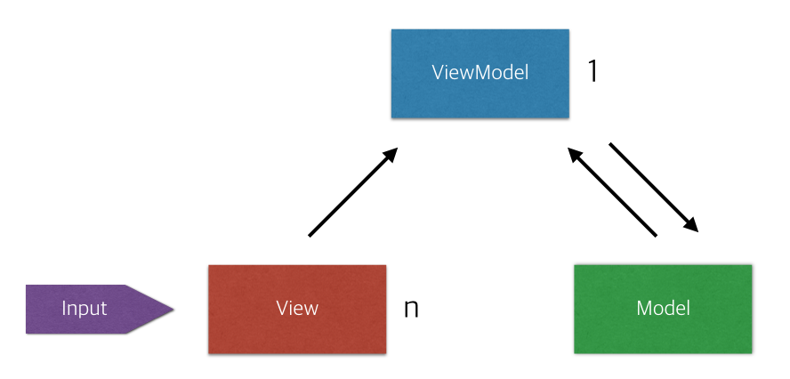

# Design Pattern

## index  

[BLoC Pattern](#BLoC-Pattern)  
[Redux Pattern](#Redux-Pattern)   
[MVVM Pattern](#MVVM-Pattern)

---

### Bloc Pattern

- BLoC 패턴은 스트림을 이용하여 만들어진다.
- 위젯이 Sinks를 통해 BLoC에 이벤트를 보내면, BLoC이 stream을 통해 위젯들에게 결과를 통지한다.  
- UI 단에서는 BLoC에 대해 신경쓰지 않는다.

 
 - [코드 출처](https://javaexpert.tistory.com/970)
~~~Dart
void main() => runApp(new MyApp());

class MyApp extends StatelessWidget {
  @override
  Widget build(BuildContext context) {
    return new MaterialApp(
        title: 'Streams Demo',
        theme: new ThemeData(
          primarySwatch: Colors.blue,
        ),
        // Provider 제공
        home: BlocProvider<IncrementBloc>(
          bloc: IncrementBloc(),
          child: CounterPage(),
        ),
    );
  }
}

class CounterPage extends StatelessWidget {
  @override
  Widget build(BuildContext context) {
    final IncrementBloc bloc = BlocProvider.of<IncrementBloc>(context);
            // bloc 인스턴스 생성
    return Scaffold(
      appBar: AppBar(title: Text('Stream version of the Counter App')),
      body: Center(
        child: StreamBuilder<int>( // StreamBuilder
          stream: bloc.outCounter, //bloc을 등록
          initialData: 0,
          builder: (BuildContext context, AsyncSnapshot<int> snapshot){
            return Text('You hit me: ${snapshot.data} times');
          }
        ),
      ),
      floatingActionButton: FloatingActionButton(
        child: const Icon(Icons.add),
        onPressed: (){
          bloc.incrementCounter.add(null);
        },
      ),
    );
  }
}

class IncrementBloc implements BlocBase {
  int _counter;

  //
  // Stream to handle the counter
  //
  StreamController<int> _counterController = StreamController<int>();
  StreamSink<int> get _inAdd => _counterController.sink;
  Stream<int> get outCounter => _counterController.stream;

  //
  // Stream to handle the action on the counter
  //
  StreamController _actionController = StreamController();
  StreamSink get incrementCounter => _actionController.sink;

  //
  // Constructor
  //
  IncrementBloc(){
    _counter = 0;
    _actionController.stream
                     .listen(_handleLogic);
  }

  void dispose(){
    _actionController.close();
    _counterController.close();
  }

  void _handleLogic(data){
    _counter = _counter + 1;
    _inAdd.add(_counter);
  }
}

///
// Generic Interface for all BLoCs
abstract class BlocBase {
  void dispose();
}

// Generic BLoC provider
class BlocProvider<T extends BlocBase> extends StatefulWidget {
  BlocProvider({
    Key key,
    @required this.child,
    @required this.bloc,
  }): super(key: key);

  final T bloc;
  final Widget child;

  @override
  _BlocProviderState<T> createState() => _BlocProviderState<T>();

// of 라는 method 선언, provider class 내의 <T> type의 bloc을 return
  static T of<T extends BlocBase>(BuildContext context){
    final type = _typeOf<BlocProvider<T>>();
    BlocProvider<T> provider = context.ancestorWidgetOfExactType(type);
    return provider.bloc;
  }

  static Type _typeOf<T>() => T;
}

class _BlocProviderState<T> extends State<BlocProvider<BlocBase>>{
  @override
  void dispose(){
    widget.bloc.dispose();
    super.dispose();
  }

  @override
  Widget build(BuildContext context){
    return widget.child;
  }
}

~~~

 
- EX) 로그인 상태 관리

    - 일반 : 메인페이지 -> 로딩 -> 로그인 확인 후, 로그인 화면 or 메인 화면
    - BLoC : 메인페이지 -> Auth(StreamBuilder) -> snapshot data가 없음 -> Loading -> 로그인 확인 후 , 로그인 화면 or 메인 화면    
    => 로그아웃 -> Auth에서 알아서 login page로 관리  
    => 간편함
- 문제점 => 애니메이션이 없다
- MVVM 패턴과 유사하다.
[MVVM Pattern](#MVVM-Pattern)

---
### Redux Pattern  

- Redux를 설명하기위해서는 MVC와 FLUX 패턴에 대한 설명이 필요하다. 

##### MVC Pattern   
  
- MVC 모델에서는 1개의 controller가 여러 모델들을 관리하는데,
큰 프로그램의 경우 다수의 컨트롤러와 뷰에 의해 수정이 되기 때문에 데이터의 흐름이 직관적이지 않다.
    - Model : 실제 데이터 및 데이터 조작 로직을 처리
    - View : 사용자에게 보이는 UI
    - Controller : 사용자의 입력을 받고 처리
##### FLUX Pattern
 
- FLUX 패턴에서는 데이터의 수정이 dispatcher 한 곳에서만
가능하도록 제약을 가했다.  

다시 Redux로 돌아오면, Redux 패턴은 Flux 패턴에 더해 store 또한 하나만 존재한다는 제약을 추가한 것이다.

##### Redux의 3가지 원칙
- store는 하나만 존재한다.
- store의 state는 오직 action을 통해서만 변경할 수 있다. (읽기 전용이다)
- reducer는 pure function이다. (같은 input -> 같은 output)

##### 사용
- 어플리케이션의 여러 곳에서 공유되는 데이터
- 다른 페이지를 갔다 올 때 상태를 유지해야 하는 데이터

---
 
### MVVM Pattern  

- MVVM 패턴을 이해하기 위해서 MVC, MVP 패턴을 함께 보겠다. MVC는 Redux 패턴에서도 설명되어있다.
[출처](https://magi82.github.io/android-mvc-mvp-mvvm/)
 
##### MVC Pattern
  
- MVC 패턴에서는 1개의 controller가 여러 모델들을 관리하는데,
  큰 프로그램의 경우 다수의 컨트롤러와 뷰에 의해 수정이 되기 때문에 데이터의 흐름이 직관적이지 않다.
    - Model : 실제 데이터 및 데이터 조작 로직을 처리
    - View : 사용자에게 보이는 UI
    - Controller : 사용자의 입력을 받고 처리
- Flow : Controller에 입력이 들어옴   
-> Model의 데이터를 업데이트 및 불러옴   
-> 해당 데이터를 보여줄 View를 선택하여 화면에 띄워줌  
- 단점 : View와 Model이 의존적. => 의존성을 줄여야함

##### MVP Pattern
    
- MVP 패턴에서는 Controller 대신 Presenter가 존재한다.
    - Presenter : View에서 요청한 정보를 Model로부터 가공해 View로 전달
    - 사용자의 입력을 view에서 받음
    - 항상 presenter를 거쳐서 동작  
    => View와 Model의 의존성이 사라짐
- Flow : View로 사용자의 입력이 들어옴   
-> View에서 presenter로 작업요청  
-> Presenter에서 필요한 데이터를 Model에 요청  
-> Model은 Presenter에 필요한 데이터를 응답  
-> Presenter는 View에 데이터를 응답  
-> View는 Presenter로부터 받은 데이터를 화면에 보여줌  
- 단점 : View와 Presenter가 의존적  

#### MVVM Pattern    
      
- 대망의 MVVM  
- Presenter(중간자) 대신 ViewModel 존재  
    - View Model : View를 표현하기 위해 만들어진 View를 위한 Model

##### Command 와 Data Binding   (중요)   
-  Flow : View로 사용자의 입력이 들어옴(MVP와 동일)  
-> Command 패턴으로 View Model에 명령  
-> ViewModel을 필요한 데이터를 Model에 요청  
-> Model은 View Model에 필요한 데이터를 응답  
-> ViewModel은 응답받은 데이터를 가공하여 저장  
-> View는 ViewModel과의 DataBinding으로 자동 갱신

            